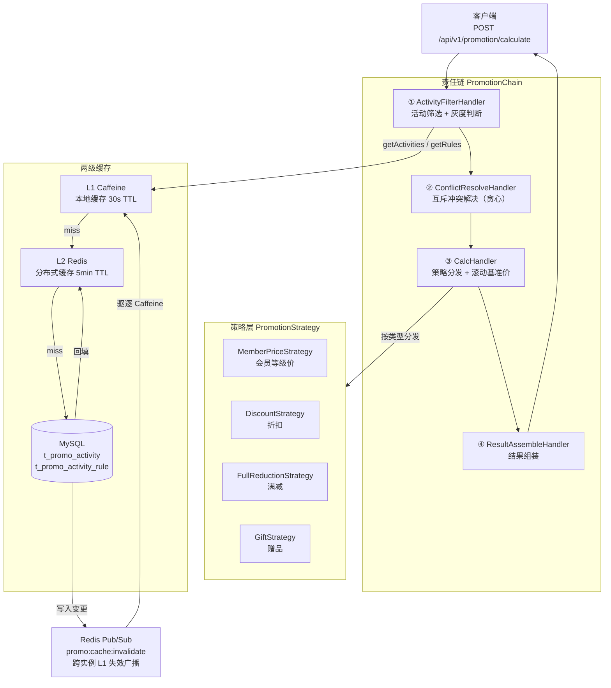

# Promotion Engine Demo

> 面向连锁零售场景的营销活动叠加引擎，支持满减、折扣、赠品、会员等级价四种活动类型任意组合，内置冲突检测、灰度发布与两级缓存。

---

## 技术架构



---

## 核心设计

### 责任链模式

请求进入后依次流经四个处理节点，节点间通过 `PromotionContext` 传递状态：

| 节点 | 职责 |
|---|---|
| `ActivityFilterHandler` | 从两级缓存加载门店活动列表，过滤 GRAY 状态活动的灰度条件 |
| `ConflictResolveHandler` | 按优先级降序贪心遍历，检测 EXCLUSIVE 冲突，高优先级活动保留 |
| `CalcHandler` | 按固定顺序（会员价→折扣→满减→赠品）调用策略，维护滚动基准价 |
| `ResultAssembleHandler` | 汇总优惠金额、合并赠品列表，输出 `PromotionResultVO` |

`PromotionHandler` 抽象类持有 `next` 指针，`PromotionChainBuilder` 在启动时按固定顺序串联各节点，调用方只需持有链头引用。

### 策略模式

每种活动类型对应一个 `PromotionStrategy` 实现，通过 `@Component` 注入 Spring 容器。`CalcHandler` 在 `@PostConstruct` 阶段将 `List<PromotionStrategy>` 按 `getType()` 建立 `Map` 索引，运行时 O(1) 定位策略。

**计算顺序与滚动基准价**：

```
currentAmount = originalAmount
  MEMBER_PRICE  →  discountAmount = currentAmount × (1 - discountRate)
                   currentAmount -= discountAmount
  DISCOUNT      →  discountAmount = currentAmount × (1 - discountRate)
                   currentAmount -= discountAmount
  FULL_REDUCTION→  hitTier = max threshold ≤ currentAmount
                   currentAmount -= tier.reduction
  GIFT          →  赠品不减 currentAmount
```

折扣始终基于会员价后的金额，满减基于折后金额，语义清晰、可扩展。

### 两级缓存

```
读请求
  └─ L1 Caffeine（进程内，maximumSize=1000，expireAfterWrite=30s）
       └─ miss → L2 Redis（跨实例共享，TTL=5min，key=promo:activities:{storeId}）
                  └─ miss → MySQL 回源，结果回填 L2（L1 由 LoadingCache 自动填充）
```

**写后失效流程**（活动创建/更新/上下线均触发）：

1. 写入 MySQL
2. 删除 Redis 中对应 key（L2 失效）
3. 向 `promo:cache:invalidate` 发布 storeId（或 `ALL`）
4. 各实例收到消息后立即驱逐本地 Caffeine（L1 失效）
5. 当前实例同步驱逐，不依赖 Pub/Sub 回调延迟

空列表同样写入 Redis（防止缓存穿透），Caffeine 使用 `LoadingCache` 避免并发回源（缓存击穿）。

### 灰度发布

活动状态为 `GRAY` 时，`GrayRuleEvaluator` 对其 `grayConfig` JSON 进行多维度 **AND** 判断：

| 维度 | 字段 | 说明 |
|---|---|---|
| 门店白名单 | `storeIds` | 订单 storeId 须在列表内 |
| 会员等级 | `memberLevels` | 订单 memberLevel 须在列表内 |
| 流量分桶 | `trafficPercent` | `abs(userId XOR activityId) % 100 < percent` |

三个维度均未配置时视为全量放开（`true`）。不同活动通过 XOR activityId 实现路由结果相互独立，避免流量分桶"扎堆"。

---

## 快速启动

### 前置依赖

| 依赖 | 版本要求 |
|---|---|
| JDK | 17+ |
| Maven | 3.8+ |
| MySQL | 8.0+ |
| Redis | 6.0+ |

### 1. 建表 & 初始化数据

```bash
mysql -u root -p < sql/init.sql
```

执行后将创建数据库 `promotion_engine`，并插入覆盖四种活动类型的示例数据（含一组互斥关系）。

### 2. 配置环境变量（可选，默认值见括号）

```bash
export DB_HOST=localhost       # (localhost)
export DB_PORT=3306            # (3306)
export DB_NAME=promotion_engine
export DB_USER=root
export DB_PASSWORD=your_pass
export REDIS_HOST=localhost    # (localhost)
export REDIS_PORT=6379         # (6379)
export REDIS_PASSWORD=         # (空)
export SERVER_PORT=8080        # (8080)
```

不设置环境变量时直接使用 `application.yml` 中的默认值，本地开发开箱即用。

### 3. 构建 & 运行

```bash
# 构建（跳过测试）
mvn clean package -DskipTests

# 运行
java -jar target/promotion-engine-1.0.0.jar
```

### 4. 运行测试

```bash
mvn test
```

35 个单元 / 集成测试，无需 MySQL / Redis（纯 Mockito，无 Spring 容器）。

---

## API 文档

### 促销计算

**POST** `/api/v1/promotion/calculate`

```bash
curl -X POST http://localhost:8080/api/v1/promotion/calculate \
  -H "Content-Type: application/json" \
  -d '{
    "orderId": "ORD-20260411-001",
    "storeId": 101,
    "memberId": 888,
    "memberLevel": "GOLD",
    "totalAmount": 280.00,
    "items": [
      {"skuId": "SKU001", "skuName": "商品A", "quantity": 2,
       "unitPrice": 100.00, "subtotal": 200.00},
      {"skuId": "SKU002", "skuName": "商品B", "quantity": 1,
       "unitPrice": 80.00,  "subtotal": 80.00}
    ]
  }'
```

响应示例：

```json
{
  "code": 200,
  "message": "success",
  "data": {
    "originalAmount": 280.00,
    "finalAmount":    214.00,
    "totalDiscount":   66.00,
    "discountDetails": [
      {"activityId": 1001, "activityName": "金卡会员专属价",
       "promotionType": "MEMBER_PRICE", "discountAmount": 28.00, "description": "9折会员优惠·GOLD"},
      {"activityId": 1003, "activityName": "满200减30",
       "promotionType": "FULL_REDUCTION", "discountAmount": 30.00, "description": "满200减30"},
      {"activityId": 1004, "activityName": "满150送保温杯",
       "promotionType": "GIFT", "discountAmount": 0, "description": "满150元赠定制保温杯"}
    ],
    "gifts": [
      {"skuId": "SKU_CUP_001", "skuName": "定制保温杯", "quantity": 1, "marketPrice": 49.90}
    ]
  }
}
```

---

### 活动管理

| 方法 | 路径 | 说明 |
|---|---|---|
| `POST` | `/api/v1/activity` | 创建活动（初始 DRAFT） |
| `GET` | `/api/v1/activity` | 分页查询（支持 status / type 过滤） |
| `GET` | `/api/v1/activity/{id}` | 查询活动详情 |
| `PUT` | `/api/v1/activity/{id}` | 更新活动信息 |
| `DELETE` | `/api/v1/activity/{id}` | 逻辑删除 |
| `PUT` | `/api/v1/activity/{id}/publish` | 上线（→ ACTIVE） |
| `PUT` | `/api/v1/activity/{id}/offline` | 下线（→ EXPIRED） |
| `PUT` | `/api/v1/activity/{id}/gray` | 设置灰度配置（→ GRAY） |

**创建活动示例（满减）：**

```bash
curl -X POST http://localhost:8080/api/v1/activity \
  -H "Content-Type: application/json" \
  -d '{
    "name":      "五一大促满500减100",
    "type":      "FULL_REDUCTION",
    "priority":  50,
    "startTime": "2026-05-01 00:00:00",
    "endTime":   "2026-05-07 23:59:59",
    "ruleJson":  "{\"tiers\":[{\"threshold\":500,\"reduction\":100}]}"
  }'
```

**设置灰度发布（指定门店 + 50% 流量）：**

```bash
curl -X PUT http://localhost:8080/api/v1/activity/1005/gray \
  -H "Content-Type: application/json" \
  -d '{
    "grayConfig": "{\"storeIds\":[101,102],\"trafficPercent\":50}"
  }'
```

---

## 项目结构

```
promotion-engine-demo/
├── pom.xml
├── CLAUDE.md                                   # 项目规范文档
├── sql/
│   └── init.sql                                # 建表语句 + 示例数据
└── src/
    ├── main/java/com/ryan/promotion/
    │   ├── PromotionEngineApplication.java
    │   ├── config/
    │   │   ├── CaffeineConfig.java             # L1 缓存规格常量
    │   │   └── RedisConfig.java                # RedisTemplate + Pub/Sub 容器配置
    │   ├── model/
    │   │   ├── entity/                         # 数据库实体（Activity / ActivityRule / ActivityConflict）
    │   │   ├── enums/                          # PromotionType / ActivityStatus / ConflictRelation
    │   │   ├── dto/                            # OrderContext（入参）/ CalcResult（计算中间体）
    │   │   └── vo/                             # PromotionResultVO（API 出参）
    │   ├── strategy/                           # 四种促销策略实现
    │   │   ├── PromotionStrategy.java          # 策略接口
    │   │   ├── MemberPriceStrategy.java
    │   │   ├── DiscountStrategy.java
    │   │   ├── FullReductionStrategy.java
    │   │   └── GiftStrategy.java
    │   ├── handler/                            # 责任链节点
    │   │   ├── PromotionHandler.java           # 抽象基类（next 指针 + passToNext）
    │   │   ├── PromotionContext.java           # 链间共享上下文
    │   │   ├── ActivityFilterHandler.java      # 第1步：筛选活动 + 灰度判断
    │   │   ├── ConflictResolveHandler.java     # 第2步：互斥冲突解决
    │   │   ├── CalcHandler.java                # 第3步：策略计算 + 滚动基准价
    │   │   └── ResultAssembleHandler.java      # 第4步：结果组装
    │   ├── chain/
    │   │   └── PromotionChainBuilder.java      # 责任链组装（@PostConstruct）
    │   ├── cache/
    │   │   └── PromotionCacheManager.java      # Caffeine + Redis 两级缓存 + Pub/Sub
    │   ├── gray/
    │   │   └── GrayRuleEvaluator.java          # 灰度规则多维度评估
    │   ├── service/
    │   │   ├── PromotionService.java           # 计算入口（持有链头）
    │   │   └── ActivityManageService.java      # 活动 CRUD + 缓存失效
    │   ├── mapper/                             # MyBatis-Plus Mapper 接口
    │   ├── controller/
    │   │   ├── PromotionController.java        # POST /api/v1/promotion/calculate
    │   │   └── ActivityController.java         # /api/v1/activity CRUD + 状态变更
    │   └── common/
    │       ├── Result.java                     # 统一响应包装
    │       └── exception/                      # BusinessException + GlobalExceptionHandler
    └── test/java/com/ryan/promotion/
        ├── strategy/                           # 四个策略单元测试（各 5~6 用例）
        ├── handler/                            # ConflictResolveHandler 测试（5 用例）
        ├── cache/                              # PromotionCacheManager 缓存测试（5 用例）
        └── integration/                        # 端到端集成测试（3 用例）
```

---

## rule_json 格式参考

| 活动类型 | rule_json 结构 |
|---|---|
| `MEMBER_PRICE` | `{"memberLevels":["GOLD","PLATINUM"],"discountRate":0.90}` |
| `DISCOUNT` | `{"discountRate":0.88,"minOrderAmount":100,"skuIds":[]}` |
| `FULL_REDUCTION` | `{"tiers":[{"threshold":200,"reduction":30},{"threshold":500,"reduction":100}]}` |
| `GIFT` | `{"minOrderAmount":150,"gifts":[{"giftSkuId":"SKU001","giftSkuName":"保温杯","giftQuantity":1,"marketPrice":49.90}]}` |

`DISCOUNT` 中 `skuIds` 为空表示全单折扣，非空则仅对列表内 SKU 打折。  
`FULL_REDUCTION` 支持多档梯度，自动选取当前金额能触达的最高档位。
